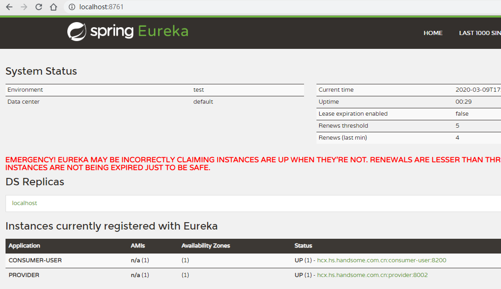

```
java.lang.IllegalArgumentException: Could not find class [org.springframework.ws.config.annotation.WsConfigurationSupport]
	at org.springframework.util.ClassUtils.resolveClassName(ClassUtils.java:332) ~[spring-core-5.2.4.RELEASE.jar:5.2.4.RELEASE]
```

```xml
<dependency>
            <groupId>org.springframework.ws</groupId>
            <artifactId>spring-ws-core</artifactId>
            <version>2.4.6.RELEASE</version>
        </dependency>
```

导致springboot启动失败，需要导入对应依赖。

另外需导入spring-web对应的包，启动web程序。

springcloud结合eureka编程步骤：

1. eureka服务器的配置及启动，
配置文件中配置如下：
```yaml
server:
  port: 8761
eureka:
  instance:
    hostname: eureka-server  #eureka实例主机名
  client:
    register-with-eureka: false # 不把自己注册到rureka
    fetch-registry: false # 不从rureka上获取服务的注册信息
    service-url:
      defaultZone: http://localhost:8761/eureka/
```
配置完成后，在启动类上添加注解@EnableEurekaServer，即可启动，启动后可以通过web界面查看对应的信息

2、 配置provider，provider的yaml配置文件如下：
```yaml
server:
  port: 8002
spring:
  application:
    name: provider
eureka:
  instance:
    prefer-ip-address: true #注册服务使用服务的ip地址
  client:
    service-url:
      defaultZone: http://localhost:8761/eureka/
```

配置完成后，可以编写对应的业务逻辑。

3.配置consumer，consumer配置文件内容如下：
```yaml
server:
  port: 8200
spring:
  application:
    name: consumer-user
eureka:
  instance:
    prefer-ip-address: true
  client:
    service-url:
      defaultZone: http://localhost:8761/eureka/
```

配置完成后，在启动类上增加注解@EnableDiscoveryClient，获取eureka服务器上的服务。接下来利用`RestTemplate`,利用轻量级http请求访问对应分布式服务。
可以增加bean属性到spring容器中，增加负载均衡的效果。如下：
```java
 @LoadBalanced  //负载均衡，默认为轮询机制
    @Bean
    public RestTemplate restTemplate(){
        return new RestTemplate();
    }
```




